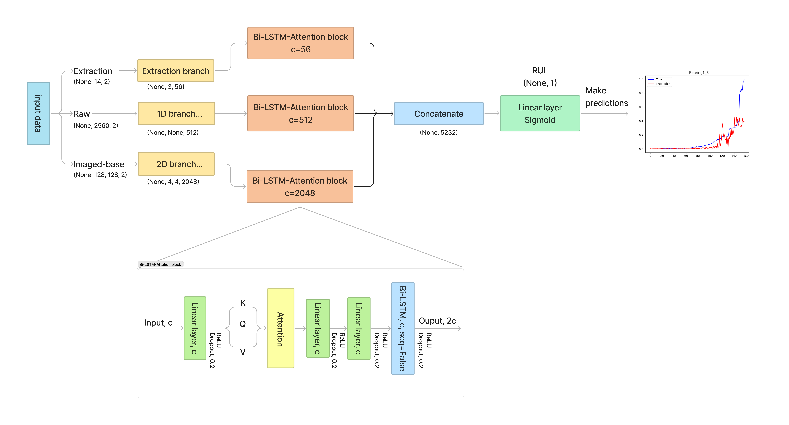
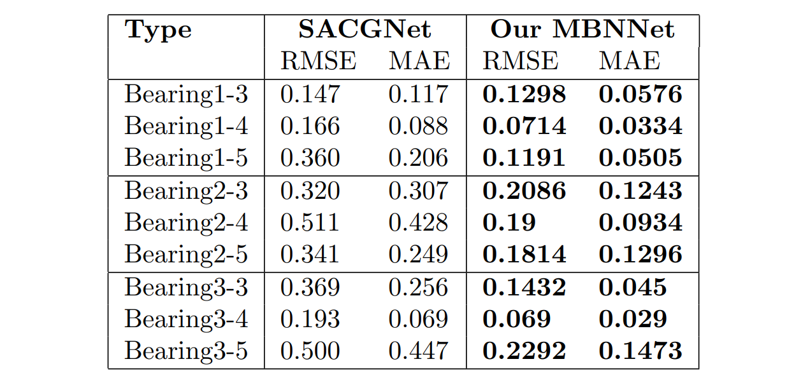

# RUL_predictor

## 1. Architecture

## 2. Data Construction
- machine001 |- Fan_NDE 
             |- Motor_DE
## 3. Guide to run code
### 3.1. Install prerequisite
> Download git repository

    git clone https://github.com/tdkhoa1212/company_RUL.git

>Enter the git folder

    cd company_RUL

>Install libraries
    pip install -r requirements.txt
### 3.2. Training process
#### Parameters in the train.py file: 
**--save_dir**,     &emsp;  default='./results', help='the directory to save results' 
**--data_type**,    &emsp;  default=['2d', '1d', 'extract'], help='types of input data' 
**--train_bearing**,&emsp;  default=['Bearing1_1', 'Bearing1_2', 'Bearing2_1','Bearing2_2','Bearing3_1','Bearing3_2'], help='data used for traing' 
**--test_bearing**, &emsp;  default=['Bearing1_3', 'Bearing1_4', 'Bearing1_5', 'Bearing2_3', 'Bearing2_4', 'Bearing2_5', 'Bearing3_3', 'Bearing3_4', 'Bearing3_5'], help='data used for testing' 
**--scaler**,       &emsp;  default='Normalizer', help='a type of normalizing method' 
**--main_dir_colab**,&emsp; default='./data' , help='the directory to the database' 
**--epochs**,       &emsp;  default=50, help='the number of iteration' 
**--batch_size**,   &emsp;  default=16, help='the batch of data for training process' 
**--input_shape**,  &emsp;  default=32768, help='the length of a typical segment of vibration signal' 
**--load_weight**,  &emsp;  default=False, help='set true if you want to use the exist weight file' 

***__Note__:*** there are some parameters needing to be changed including ***save_dir, train_bearing, test_bearing, main_dir_colab, input_shape, load_weight***
#### Run:
    python train.py --save_dir 'the path leads to the saved result folder' 
### 3.3. Testing process
## 4. Result

## 5. Citation: TODO
